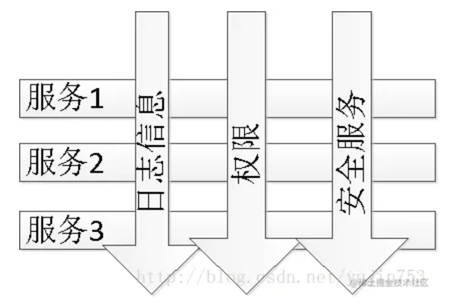

# AOP
    AOP可以分离系统的业务逻辑和系统服务(日志，安全，权限校验等)

# AOP中的基础概念
## Advice 通知

# 参考文件
1. https://juejin.cn/post/7244492473933365304
2. https://juejin.cn/post/6844903575441637390?searchId=202308101745244284220AA0995717F563