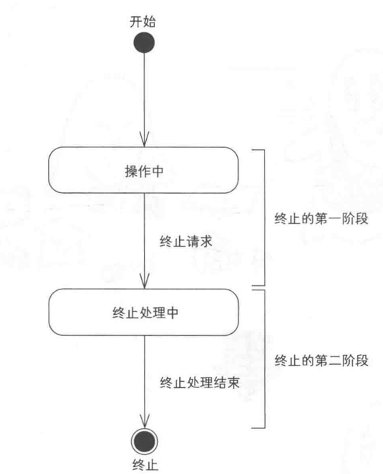
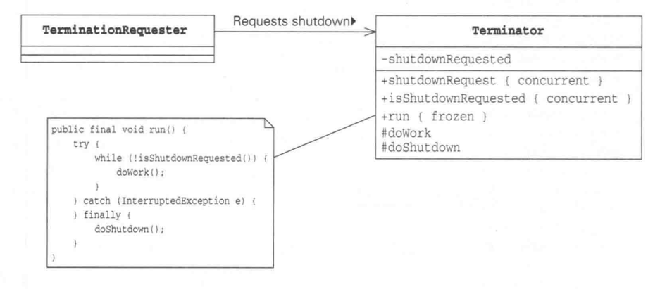
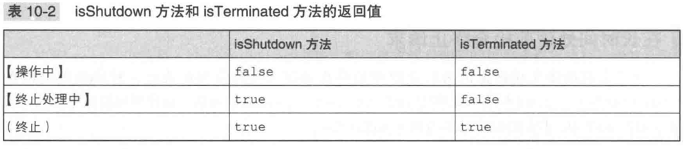

# Chapter 10. Two-Phrase Termination

小孩子在玩玩具的时候会将玩具弄的满屋子都是，到了晚上睡觉时间，妈妈就会对小孩子说，先收拾房间再睡觉，这个时候，小孩子会开始打扫房间。
这就是“Two-Phrase Termination” 模式。
    
这个模式的名称是分两个阶段终止的意思，它是一种 先执行完终止处理再终止线程的模式，用于终止处理。



该模式的要点如下：
- 安全地终止线程（安全性）
  即使接收到终止请求，线程也不会立即终止，首先设置shutdownRequested标志为true, 表示已经接收终止请求。然后，仅在线程运行至不会破坏
    安全性的位置时，才会终止处理。
- 在终止处理时进行必要的“打扫”处理（生存性）
    线程在接收到终止请求后，会中断wait，转入终止处理，为此，shutdownRequest方法会调用interrupt(), 在finally语句中做异常终止
    处理。
- 发出终止请求后尽快进行终止响应（响应性）

Two-Phrase Termination模式就是用来优雅地终止线程的
> UML



> isShutDown 和 isTerminated


> 中断状态和InterruptedException互换身份

当线程调用interrupt方法，线程就处在中断状态，当线程正在sleep, wait, join时会抛出InterruptedException, 这个时候线程不会变为中断
状态。但是，中断状态和InterruptException可以进行转换，通常是未来防止代码忘记线程已经被中断了

```java
if (Thread.interrupted()) {
    throw new InterruptedException();
}
```