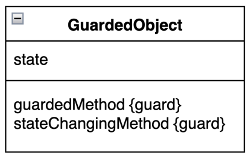

# Balking模式

与Guarded Suspension模式一样，也存在守护条件。
在Balking模式中，如果守护条件不成立，则立即中断处理，
但是在Guarded Suspension中，如果守护条件不成立，会进入该对象的等待队列中。

## Balking模式中的角色
- GuardedObject： 临界资源，被保护的对象。

  在BaseCase案例中，Data扮演此角色。
  其中save方法对应的是`guardedMethod`方法，若守护条件成立i，则执行相应的处理
  ，否则，则直接返回。而change方法则是状态改变的方法。

## balk结果的处理

像这种守护条件不成立后，直接返回的处理方式有三种。

- 忽略。不通知调用放，直接返回。
- 通过返回值表示balk。如使用数值或者是null。
- 通过异常来表示balk。

## 与其他设计模式比较

- Guarded Suspension， 在guardedMethod的守护条件成立之前，线程会一直等待。在Balking模式，
  ，守护条件不成立，线程直接返回。
- Observer，在多线程环境下使用Observer模式，会用到Balking模式。Subject角色通知Observer角色状态
  发生变换时，如果Observer角色的状态不适合处理该通知，则会balk该通知处理。

# 超时 guarded timeout

超时就是在守护条件成立之前等待一段时间，如果守护条件还没有成立，就直接返回，balk.
```java
obj.wait()
```

> wait何时终止
  
- notify/notifyAll 
- interrupt
- timeout 

但是无法区分wait()是被notify/notifyAll了还是timeout了，因此需要编写一些复杂的代码。

`synchronized`中没有超时，也不能中断。 synchronized 和 synchronized 代码块都无法设置超时时间。

## java.util.concurrent中超时处理的方式 

（1）通过异常通知
- java.util.concurrent.Future.get()
- java.util.concurrent.Exchanger.exchanger()
- java.util.concurrent.Cyclicarrier.await()
- java.util.concurrent.CountDownLatch.await()

（2）通过返回值通知
- java.util.concurrent.BlockingQueue.offer(): false 
- java.util.concurrent.BlockingQueue.poll(): null
- java.util.concurrent.Semaphore.tryAcquire(): false
- java.util.concurrent.locks.lock.tryLock(): false