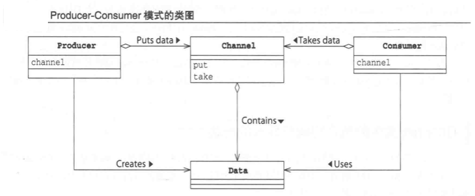
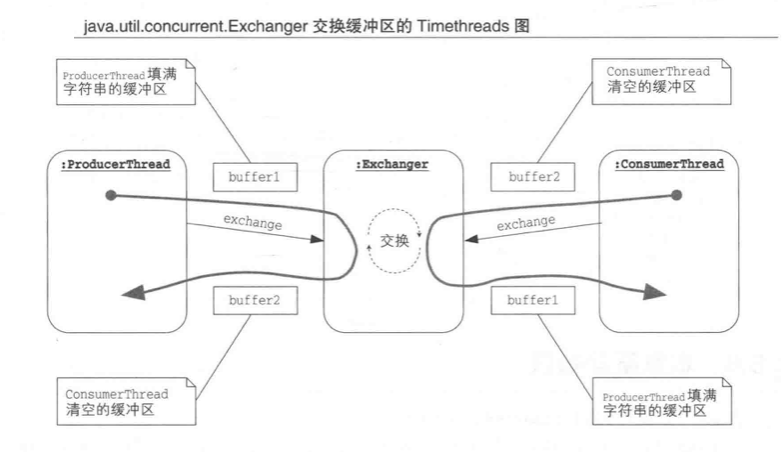

# Producer-Consumer

当生产者和消费者的角色分别只有一个时，称之为`Pip模式`。

> BaseExample说明

- MakerThread : 制作蛋糕String, 并将其放置到Table, Table上最多放置三个蛋糕。如果超出，则等待桌子空出位置。
- EaterThread : 取蛋糕来吃，桌子上一个蛋糕都没有时，必须等待桌子上有蛋糕。

> Producer-Consumer模式中的角色

- Data: 由Producer产生，由Consumer消费，在本案例中是String
- Channel: 保管Data的角色，承担安全守护责任，执行线程之间的互斥处理，实现线程的协调运行。
  在本案例中是Table的角色。在该类中，put和take方法都加上类sync.关键字。
- Producer : 生成Data角色，并将其传递给Channel 
- Consumer : 消费Data角色，从Channel中获取数据

当只有一个Consumer，就无需注意Consumer角色的线程之间的影响。Producer的角色有多个，Consumer的角色有一个的情况下，
相当于将多线程的处理放进单线程中。

## 扩展1

- 添加了 InterruptedException的方法，表明该方法比较耗费时间，可以随时取消。

- 常见的添加了InterruptedException的方法，常见的有三个：
  - Object.wait()
  - Thread.sleep()
  - Thread.join():线程执行join方法后，会等待指定线程终止。

> sleep() ｜ interrupt()

- interrupt方法是Thread的实例方法，执行interrupt方法时并不需要获取锁，任何时候，线程都可以调用其他线程的interrupt方法。

- interrupt 方法调用后，正在sleep的线程会终止暂停状态，抛出InterruptedException。

> wait() | interrupt()

- 使用interrupt 方法后，表示告诉正在等待的线程，不用等notify / notifyAll，直接从等待队列中退出。

- 当线程wait的情况下，线程进入等待队列，已经释放了锁，此时若有其他线程调用该线程实例的interrupt()方法，该线程会在
  重新获取锁之后，抛出异常，在获取锁之前不会抛出异常。

> join() | interrupt()

- 调用join()方法不需要获取锁
- 调用interrupt的方法后，调用join()方法的线程会立即抛出异常。

> 中断状态

本质上，调用 `interrupt` 方法，只是改变了线程的中断状态，这是一种用于表示线程是否被中断的状态。

当线程Alice因为执行了`sleep`, `wait`, `join`而停止运行，Bob调用了Alice的`interrupt`，线程会抛出InterruptedException，这是因为sleep, wait, join
内部对线程的中断状态进行检查，才会抛出`InterruptedException`。当时当执行加减赋值操作，即使调用interrupt方法，Alice也不会抛出
InterruptedException，而是继续执行处理。除此之外，for, while, if语句都不会检查中断状态，Alice不会抛出异常，还是会继续执行。只有当Alice
执行到sleep, wait, join等方法，才会抛出异常。

因此要在必要的代码中，做线程的中断状态检查。

> 检查中断状态

- isInterrupted() : Thread的实例方法，用于检查指定线程的中断状态。
- Thread.interrupted() : 【检查并清除中断状态】Thread的静态方法，用于检查并清除线程的中断状态。
- interrupt(): Thread的实例方法，用于让线程变为中断状态的方法。

> ！！！ 不可以使用Thread.stop()方法，因为该方法会破坏安全性，即使线程正在临界区中运行，调用
> stop方法也会被立刻中断，这是非常危险的操作。

## 扩展2

`java.util.concurrent.BlockingQueue`可以充当Channel的角色。

- BlockingQueue接口：阻塞队列
- ArrayBlockingQueue: 基于数组的BlockingQueue
- LinkedBlockingQueue: 基于链表的BlockingQueue
- PriorityBlockingQueue：带有优先级的BlockingQueue
- DelayQueue：一定时间之后才可以take的BlockingQueue
- ConcurrentLinkedQueue: 没有最大限制的线程安全队列

# 类交换缓冲区

java.util.concurrent.Exchanger用于让两个线程安全地交换对象。
具体用法参考ExchangerExample代码，该代码用于ProducerThread和 ConsumerThread 之间相互交换缓冲区。

