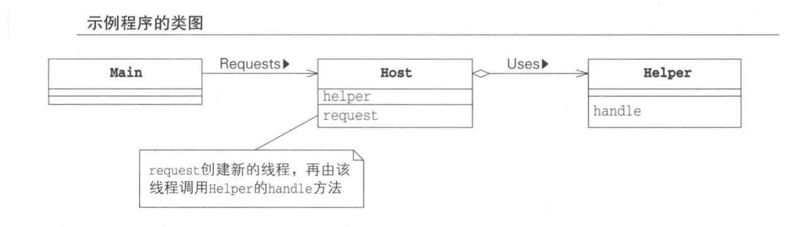
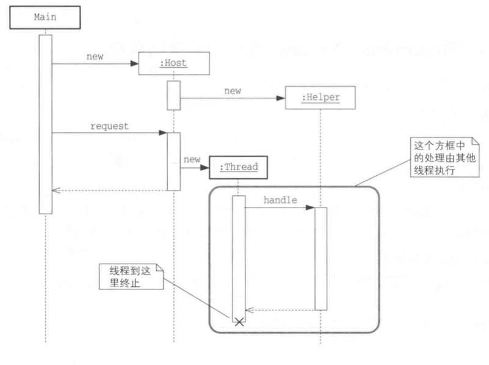
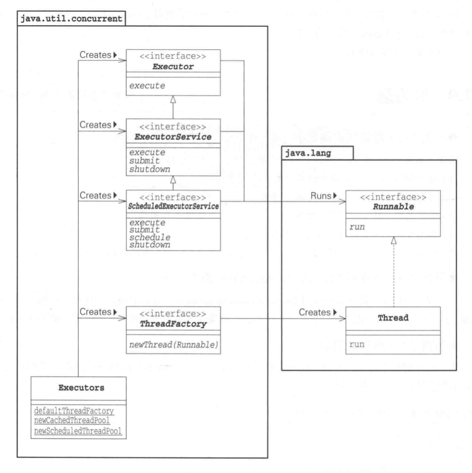

# Thread Pre Message

为每一个命令或者请求新分配一个线程，由这个线程来执行处理。在该模式中，消息的 委托端 和
执行端是不同的线程。

委托端告诉执行端，这个线程交给你执行了。

> Example

该案例中出现的角色：
- Client : 委托人，Client 角色会向Host发送请求
- Host: Host角色收到Client的请求后，会新创建并启动一个线程，新创建的线程
  使用Helper角色来处理请求
- Helper：角色为Host角色提供请求处理的功能，Host角色创建的新线程会利用Helper角色。

## 该方法使用的场景

- 提高响应时间：Thread-Pre-Message模式中，Host角色会启动新的线程，该方法能够减少程序的
  响应时间。由于启动线程也会花费时间，所以是否使用该模式，需要综合考虑，handle操作花费的时间和
  启动线程花费的时间。
- 适用于操作顺序没有要求，handler方法并不是按照request方法的调用顺序来执行的，
  当按照某种顺序执行时，Thread-Pre-Message并不适用。
- 适用于不需要返回值时，request方法并不会等待handle方法执行结束，所以request得不到handle的
  运行结果。如果需要获取操作结果，可以使用Feature模式（第9章）。
- 应用于服务器，为了使服务器处理多个请求，可以使用Thread-Pre-Message模式。服务器本身的线程接收
  客户端的请求，而这些请求的世纪处理则由其他线程处理。服务器本身的线程返回等待客户端的其他请求。
- 发送异步消息。

## 相关设计模式
- Feature模式， Feature模式会先创建一个用于存储返回值的对象Feature，执行实际操作的线程在执行结束后，
  会将返回值写入Feature对象中，当发送请求的线程需要返回值时，便会从Feature角色中获取。
- Worker Thread 模式，该模式会先启动所需数量的线程，循环使用，从而提高程序性能。

## 调度运行

`java.util.concurrent.ScheduledExecutorService` 是 `ExecutorService` 的子接口，用于推迟操作的执行。本案例中的
`org.thread.chapter7.ScheduleExecutorExample` 是这个调度运行的案例。

