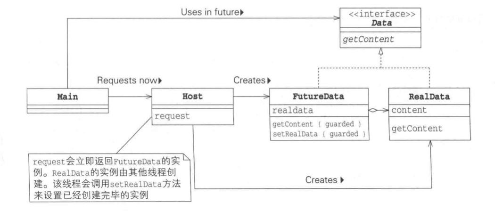
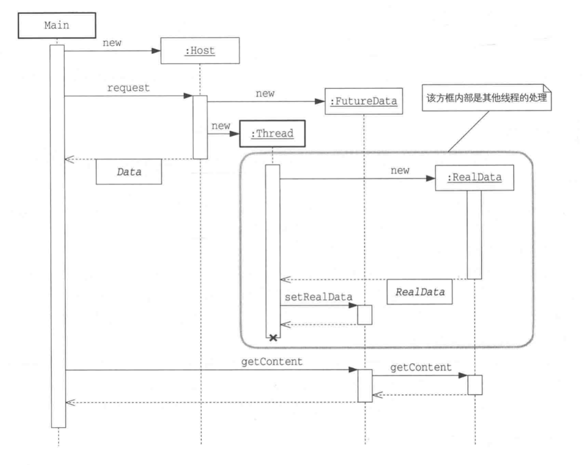

# Feature

假设一个方法需要花费很长的时间，那么与其等待结果，不如拿一张提货单（Future）

> 类图

> 时序图

Java的方法调用全部是异步的，调用了某个方法，只能等待该方法执行完毕后才能继续执行，Thread-Per-Message模式通过创建一个新的线程，模拟实现
异步，只是Thread-Per-Message 模式无法获取处理异步的结果，我们可以通过Future模式来获取。

> getContent方法的实现可以是异步的

getContent() 可以使用Balking 模式来实现，如果还没创建完成，就暂时返回，然后稍微执行其他操作后再去调用getContent

> 会发生变化的Future角色

通常情况下，“返回值”仅会设置到Future角色中一次，Future角色只是状态只会改变一次的变量，但是一些特殊场景中，可能会给Future角色多次设置返回值。
如，通过网络获取图像时，希望最开始先获取图像的长宽，然后获取模糊图像的数据，最后获取清晰图像的数据。 此时，Future会用到

> 如何处理因异常而无法获取返回值的情况

